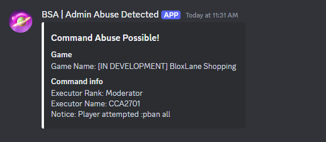

   **B**loxlane **S**ystem **A**dmin

 Guidelines

<u>**TSA Info**</u>

A modified version of the Basic Admin Essentials command system, modified to work with the BloxLane HTTP API, anti-exploits, and more. Created by PostedDevOfficial

 Written by PostedDevOfficial

*Group Owner, BSA developer*

# 1 | Commands

##  1A | Permission Levels
| Rank | Admin Level |
|:-------------------:|:--------------------:|
| Assistant Supervisor| Moderator |
| Floor Supervisor | Moderator |
| Assistant Manager | Moderator |
| Store Manager | Moderator |
| Assistant Manager | Moderator |
| Assistant Director | Administrator |
| Store Director | Administrator |
| Executive Assistant | Administrator |
| Store Executive | Administrator |
| Junior Moderator | Super Administrator |
| Senior Moderator | Super Administrator |
| Head Moderator | Super Administrator |
| Store Developer | Creator |
| Group Owner | Creator |

Depending on your role, you will only be able to perform certain actions. For Example, Moderators cannot run :pban but Super Administrators can.

## 1B | Executing commands

When executing commands, you must take care to ensure that you are doing it correctly. Running commands in public chat is ***NOT ALLOWED***.

BSA Allows you to run a command by putting a '/e' in front of a command, and there is also the console. (' or ;)

To run a command privately with the '/e' method, you need to first open up chat to run a command like you usually would. Before running the command, however, you need to type '/e'. EG:

`/e :m Hello!!!`

This will make the command private, and hidden from the chat. 

To use the console, you need to first press ; or ‘ on your keyboard, and this will cause a GUI to appear at the top of your screen. When using the console, the prefix is not required. EG:
``; (Console Opens)
exploitlogs
(Exploit logs GUI is then shown as expected)
``

# 2 | Anti-Exploit
As mentioned at the start of this document, TSA features a built in Anti-Exploit system, which keeps out exploiters, and automatically bans / kicks depending on the severity.

Whenever an exploiter is detected, a hint gui will appear at the top of all the players in the game screen, and show details of the exploiter, and the action that the system will take. 

All users have a two strike system. Strike one is a kick and Strike 2 is a pban.

All detected exploits can be viewed with the :exploitlogs command. 
**Please do not stay under the impression that :exploitlogs will show exploiters who are currently in the server, and show what they are doing. The system cannot detect everything, and only logs when an exploiter is automatically banned.**

If you are running a shift, and you notice that an exploiter gets banned, **please do not call for an SHR unless they are able to rejoin. It may take upto 30 seconds for them to be kicked again, as the HTTP API needs to be re-synced!**

# 3 | Downtime

Downtime, also known to many as “THE ADMINS NOT WORKING!!!!!!!”, is a time in which a critical error has occurred within the code, stopping all commands being run, and by extension, your admin being given.

In this scenario, the JMs+ kindly request that **you do not spam ping us, dm us repeatedly or anything of the sort when this occurs.** ***Doing is so is punishable***, and could get you suspended, or even fired. Posted is aware of the problems, and is likely fixing them as you worry. 

A simple fix may just be that you need to rejoin. If a server shuts down, lots of people rejoining at exactly the same time can overload the system, and may cause your admin loading to be delayed, or just completely aborted. For this reason, we request that you **wait a few minutes** before rejoining, or **just simply rejoin**.

# 4 | Acceptable Usage

All Major admin abuse (Running :pban all etc) is **logged** and will result in an instant punishment! The command will be instantly canceled, and developers notified: 

# 5 | Conclusion

Thank you for reading this document!

There is a lot to take in here

Please ensure you take all this in, and refer back to it if you have questions!

If you have a question about BSA, please refer to **this document first before asking an SHR!**

Thank you!

PostedDevOfficial

